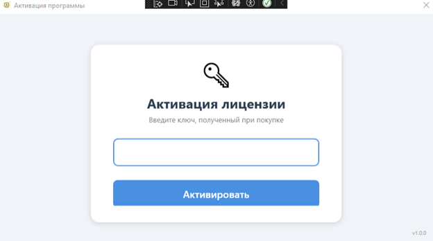
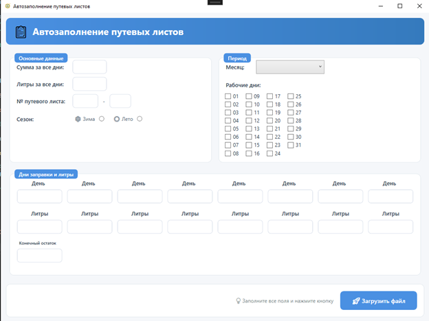
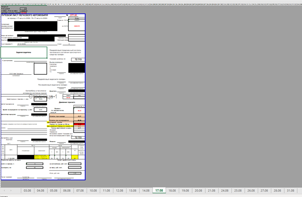

⛽ Fuel Report Automation System
Коммерческое Full-Stack приложение (WPF + ASP.NET Core) для автоматизации бухгалтерской отчетности компании.
Проект разработан для решения реальной бизнес-задачи: устранения ручного труда при формировании сложных Excel-отчетов по ГСМ и внедрения системы контроля доступа (лицензирования).

⚠️ Важно: Данный репозиторий содержит адаптированную версию продукта для демонстрации навыков. Реальная клиентская база данных и продакшн-сервер изолированы. В этом репозитории предоставлена полная инструкция для запуска на локальной машине с демо-данными.

⚠️ Важно: Файл appsettings.json исключен из репозитория по соображениям безопасности.
Скопируйте appsettings.Example.json → переименуйте в appsettings.json → заполните своими данными.

🛠 Технологический стек
Backend: ASP.NET Core Web API (.NET 6/7/8), Entity Framework Core, PostgreSQL
Client: WPF (.NET Framework / .NET Core), Microsoft Office Interop, HttpClient
Architecture: Client-Server, REST API, MVVM (частично), Repository Pattern
DevOps: Git, Docker, VPS Deployment

🚀 Как запустить проект (Локальная демо-версия)
Вам не нужен доступ к удаленному серверу. Проект полностью готов к локальному запуску.
Шаг 1: База данных
Установите PostgreSQL (если еще не установлен).
Создайте новую базу данных (например, fuel_demo_db).
Выполните SQL-скрипт из папки /Database/schema.sql для создания таблиц и наполнения тестовыми данными.
Тестовый лицензионный ключ для входа: CLIENT_TEST_002
Шаг 2: Настройка Backend (Сервер)
Откройте папку Server в Visual Studio или Rider.
Найдите файл appsettings.json.
Обновите строку подключения (DefaultConnection) на ваши локальные данные:
json
Запустите проект ServerExcelRabota. API будет доступен по адресу: http://localhost:5000 (или порт из launchSettings.json).
Swagger UI доступен по адресу: http://localhost:5000/swagger.
Шаг 3: Настройка Client (Приложение)
Откройте решение Client/mamaRabota.sln.
В файле LoginWindow.xaml.cs (или в конфиге, если вынесли) убедитесь, что адрес API указывает на http://localhost:5000.
Запустите приложение.
В окне входа введите ключ: CLIENT_TEST_002.
Приложение успешно активируется и откроет главный экран.

💡 Ключевые особенности реализации
1. Сложная работа с Excel (Interop)
Приложение не просто заполняет ячейки, а динамически управляет структурой книги:
Автоматическое копирование листов-шаблонов под количество рабочих дней.
Программный парсинг и обновление формул в Excel при изменении структуры (метод UpdateFormulasInSheet).
Алгоритм балансировки остатков ГСМ.
2. Система лицензирования (HWID Binding)
Реализован полноценный backend-модуль защиты:
Генерация уникальных ключей.
Привязка лицензии к Hardware ID (CPU/Motherboard) устройства.
Защита от повторной активации на других ПК.
Административный сброс привязки через API (PATCH /api/license/reset/{key}).
3. Клиент-Серверная архитектура
Разделение логики валидации и хранения данных на сторону сервера.
Асинхронное взаимодействие клиента с API через HttpClient.
Централизованное управление состоянием лицензий.

📸 Скриншоты
### Окно активации лицензии

### Главный интерфейс программы

### Пример сгенерированного отчета

Автор: Александр Мальцев
Связь: @anachousss | sashatscrew312@gmail.com
